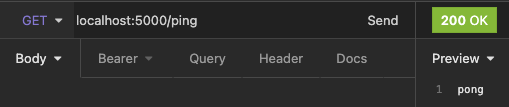

# F# Friday 3

Hei og velkommen til den tredje posten i en serie om programmeringsspråket F#!

[Forrige gang]() startet vi å definere typene vår lille matoppskrifts-app skal bestå av. Vi lagde også noen enkle hjelpefunksjoner som lar oss opprette oppskrifter. Denne gangen skal vi putte denne koden inn i en backend, slik at vi kan utføre CRUD operasjoner på og med oppskriftene våre.

## Dagens agenda 📋

Denne gangen skal vi se på hvordan man kan strukturere en server i F#. Her finnes det ganske mange forskjellige biblioteker som alle har sine egne filosofier og egne måter å gjøre ting på. Samtidig så håndterer de fleste HTTP-requests på en ganske så lik måte. Så kunnskap er ganske overførbar mellom disse forskjellige alternativene. Vi skal se på en som er ganske populær: nemlig [Giraffe](https://github.com/giraffe-fsharp/Giraffe), men aller først må vi en tur innom fugleriket.

## Kestrel 🐦
Dersom man har jobbet litt i Dotnet-verden fra før kjenner man antageligvis igjen navnet [Kestrel](https://docs.microsoft.com/en-us/aspnet/core/fundamentals/servers/kestrel?view=aspnetcore-5.0). Det er web server implementasjonen som er standard i ASP.NET Core. Giraffe biblioteket er en funksjonell wrapper på Kestrel for å forenkle dens bruk i F#.

Giraffe lar deg konfigurere både app og services som du kanskje kjenner igjen fra C#, samtidig som den lar deg jobbe med routes på en enkel måte. Den største forskjellen er nok at de har kvittet seg med den objekt- og dependency injection orienterte måten å gjøre ting på. Nå trenger man kun å forholde seg til enkle funksjoner og funksjonskomposisjon.

I Giraffe fungerer routing slik at du har funksjoner for hver HTTP metode. Disse funksjonene kan du bruke med funksjonskomposisjon for å definere hva som skal skje for hver av disse rutene. For eksempel:

```fsharp
let ruter =
    choose
        [ POST >=> choose [ route "/login" >=> loginHandler
                            route "/logout" >=> logoutHandler
                          ]
          GET >=> choose [ route "/ping"  >=> text "pong"
                           route "/userInfo" >=> userInfoHandler
                         ]
        ]
```

Det første man nok legger merke til her er den underlige operatoren: >=>. Operatoren er shorthand for funksjonen composeog kan tenkes på som en annen måte å komponere sammen funksjoner på. Den kalles for en fishbone operator og utfører kleisli-komposisjon, du kan lese mer i [denne](https://functional.christmas/2019/14) artikkelen, men det er ikke nødvendig for å følge med videre her.

I eksempelet over har vi definert 4 ruter i en liste. Vi ser at vi har 2 POST endepunkt hvor man kan velge mellom 2 ruter, login og logout. Dersom ruten matcher en av disse så utføres den tilsvarende funksjonen. Så en POST request til ruten `/login` kaller funksjonen `loginHandler`.

Det er ganske enkelt og det er veldig fort gjort å sette opp nye ruter. Giraffe har også noen innebygde funksjoner som gjør det enklere å returnere tekst eller json direkte. Dette ser vi i `ping` endepunktet.

Dette er også veldig enkelt å bygge videre på. La oss si at `Get "/userInfo"` ruten trenger autorisering. Da kan du lage en funksjon som tar seg av det og den kobles rett inn i komposisjonen:

```fsharp
route "/userInfo" >=> mustBeLoggedIn >=> userInfoHandler
```

## Giraffe setup 🦒
Okei nok teori. Learn by doing, I say!

Forhåpentligvis har du allerede et prosjekt liggende fra forrige artikkel for nå trenger vi å hente ned Giraffe nuget pakken. I skrivende stund er nyeste versjon 5.0.0, så skriv dette i en terminal i prosjektet ditt:

```fsharp
dotnet add package Giraffe - version 5.0.0
```

Med Giraffe installert så kan vi sette opp en helt enkel backend. La oss starte med å definere en testrute så vi kan sjekke at alt funker:
```fsharp
let routes = choose [ route "/ping" >=> text "pong"]
```

Dersom du ikke spesifiserer en spesifikk HTTP metode så vil den funke på alle.

Vi trenger noen funksjoner for å sette opp Giraffe også.

```fsharp
let configureApp (app: IApplicationBuilder) =
    app.UseGiraffe routes
let configureServices (services: IServiceCollection) =
    services.AddGiraffe() |> ignore
```

Disse funksjonene vil tilsvare det du finner i en typisk `startup.cs` fil i et C# backend prosjekt, så om du ønsker å legge til CORS eller andre ting er dette stedet å gjøre det på. I disse funksjonene har vi sagt hvilke ruter vi ønsker å bruke samt lagt til Giraffe.

Det eneste vi mangler nå for å ha en fungerende backend er å koble alt dette sammen med en `webHostBuilder`. I Giraffe vil de se slik ut:

```fsharp
[<EntryPoint>]
let main args =
    Host.CreateDefaultBuilder(args)
        .ConfigureWebHostDefaults(
            fun webHostBuilder ->
                webHostBuilder
                    .Configure(Action<IApplicationBuilder> configureApp)
                    .ConfigureServices(configureServices)
                    |> ignore)
        .Build()
        .Run()
    0
```

Dette vil knytte alt sammen og initialisere serveren vår.

La oss starte serveren vår og bruke en REST-klient til å sjekke endepunktet vårt.



It wooooooorks! Med 30 linjer kode har vi en fungerende backend.

## Ruter 🪟

La oss sette opp ruter til de forskjellige funksjonene vi ønsker å støtte. I første omgang så kan vi starte med å:

- Hente ut alle oppskriftene.
- Lagre nye oppskrifter.
- Oppdatere en oppskrift.
- Slette en oppskrift.

For å få til dette så trenger vi disse metodene: `GET`, `POST`, `PUT` og `DELETE`

```fsharp
let routes =
    choose [ GET    >=> route  "/api/recipes"    >=> getRecipes 
             POST   >=> route  "/api/recipe"     >=> postRecipe
             PUT    >=> route  "/api/recipe"     >=> putRecipe
             DELETE >=> routef "/api/recipe/%O" deleteRecipe
             RequestErrors.NOT_FOUND "Not found"
           ]
```

I vår delete request sier vi også at vi forventer en GUID. Dette gjør vi ved å bruke `routef` funksjonen sammen med `%o` som er Giraffes måte å si at vi forventer en eller annen query parameter her. `%o` er GUID, men det finnes mange [flere](https://github.com/giraffe-fsharp/Giraffe/blob/master/DOCUMENTATION.md#routef).

Her har vi også lagt inn en default rute, så dersom man har en request som ikke treffer noen av de definerte rutene så får vi en 404 - Not Found.

Det vi trenger nå er å implementere disse funksjonene som rutene bruker.

## Database? 📒
Vanligvis når man har en backend har man også en database som lagrer data. Det skal vi også gjøre, men ikke denne gangen. Til å starte med skal vi gjøre det veldig enkelt og heller bruke en klasse og en C# dictionary til å lagre oppskriftene våre. Det betyr dessverre at dataen ikke blir persistert, men det er noe vi kan fikse senere. Implementasjonen av denne databasen er ikke så veldig viktig så den hopper jeg over her, men du kan finne den på github.

Det jeg har gjort derimot er å lage wrapper funksjoner rundt metodene denne klassen tilbyr, så det blir enklere å bytte den ut senere.

```fsharp
let getAllRecipes () = fakabase.GetRecipes ()
let addRecipe newRecipe =
    fakabase.AddRecipe newRecipe
let updateRecipe recipeToUpdate =
    fakabase.UpdateRecipe recipeToUpdate
let deleteRecipe id =
    fakabase.DeleteRecipe id
```

## HttpHandlers
Det aller siste vi trenger for å få dette systemet til å fungere er noen [HttpHandlers](https://github.com/giraffe-fsharp/Giraffe/blob/master/DOCUMENTATION.md#httphandler). Det er funksjonene som håndterer http-requestene våre. Det vi vil at disse funksjonene skal gjøre er å konvertere JSON som kommer med nettverkskallet over til oppskriftstypen vi allerede har definert. Så skal de utføre en oppdatering mot databasen vår og til slutt returnere noe.

```fsharp
let getRecipes: HttpHandler =
    fun (next: HttpFunc) (context: HttpContext) ->
        json (Recipe.getAllRecipes ()) next context

let postRecipe: HttpHandler =
    fun (next: HttpFunc) (context: HttpContext) ->
        task {
            let! newRecipe = context.BindJsonAsync<Recipe.Recipe>()
            Recipe.addRecipe newRecipe
            return! getRecipes next context
        }

let putRecipe: HttpHandler =
     fun (next: HttpFunc) (context: HttpContext) ->
        task {
            let! recipeToUpdate = context.BindJsonAsync<Recipe.Recipe>()
            Recipe.updateRecipe recipeToUpdate
            return! json recipeToUpdate next context
        }

let deleteRecipe (id: System.Guid): HttpHandler =
        Recipe.deleteRecipe id
        text $"Deleted recipe with id: {id}"
```

Noen ting å legge merke til her:

- `next` er den neste http funksjonen som skal kjøres.
- `context` har informasjon om http-requesten.
- `task` er hvordan man kan bygge asynkrone kodeblokker, disse taskene oppfører seg likt som de gjør i C#.
- Ut fra `context` kan vi mappe JSON bodyen over til oppskriftstypen vi har definert.
- Vi kan kalle andre HttpHandlere fra HttpHandlers, det kan vi se i `deleteRecipe` hvor vi kaller text handleren.

Når alt denne er inne, og koden forhåpentligvis kompilerer, kan vi teste dette i rest-klient. Hos meg funker nå alle disse rutene, her er GET:


## Og vi er i mål 🏁
Da er vi ferdige. Det ble mye greier denne gangen så om du ønsker å se alt i sin helhet er koden å finne på github. Det eneste ekstra som finnes i repoet er CORS, en annen måte å serializere F# typer til JSON på og vår fakabase.

Det vi har lært i dag er hvordan Giraffe fungerer og hvor enkelt det er å sette opp en simpel backend med det. Vi har sett hvordan Giraffe er bygd på Kestrel og at konseptene er like med det vi kjenner fra C#. Vi kan nå sette opp ruter og har fått lagd en falsk database som bruker koden vi skrev forrige gang til å forsyne oss med oppskrifter.

Jeg føler det er viktig å nevne at det finnes mange alternativer til Giraffe. Selv liker jeg [Saturn](https://saturnframework.org/) godt. Det er et bibliotek som bygd på Giraffe og abstraherer bort en del av oppsettet. Det finnes andre alternativer også: [Oryx](https://github.com/cognitedata/oryx), [Suave](https://github.com/SuaveIO/suave), [Falco](https://github.com/pimbrouwers/Falco) og sikkert flere jeg ikke kommer på i farta. Så her er det bare å leke seg.

Selv om vi nå kan dele oppskriftene våre med verden har serveren vår noen mangler:
- Som vi allerede vet har vi ingen database. 
- Ei heller har vi logging så om noen feil skulle inntreffe får vi aldri beskjed. 
- Vi har ingen error håndtering, så dersom systemet ikke får til å parset JSON bodyen over til en oppskrift går det veldig galt.

Vi har med andre ord mye forbedringspotensiale her.

Neste gang skal vi lage en enkel frontend for dette systemet. Da skal vi lære hvordan vi kan dele kode mellom frontend og backend, bruke F# til å skrive react kode med typesikker markup og CSS. Det blir bra!